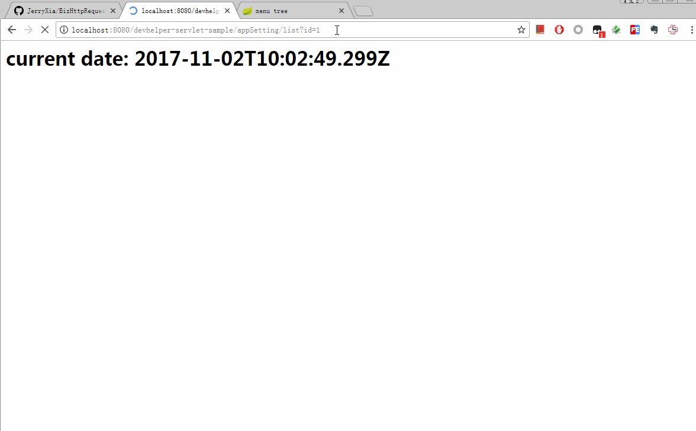

# BizHttpRequestTest

This is a helper tool library in developing or testing java web application.

If you are debugging apis with front-end engineers, you may encounter the following situation, they tell you that one of the apis returns an error, then you will ask them to send you their request details, througth you have logged the request records in your application. Then you will copy to Postman to testing the reqeust on your localhost, and debugging step by step, this library can help you resolve this problem.

## Quick Start

## Dashboard

